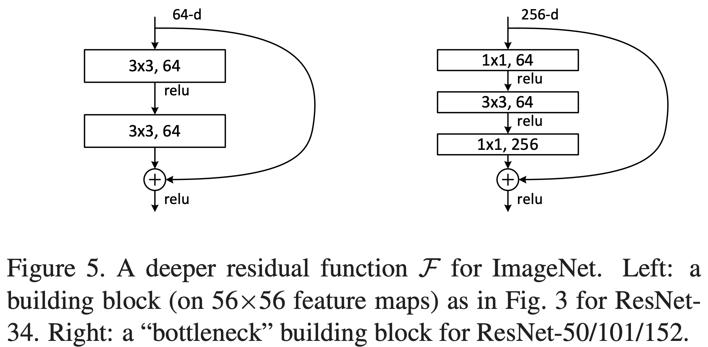

[TensorFlow 2] Deep Residual Learning for Image Recognition
=====

## Concept
<div align="center">
    
  <p>The two kinds of residual block [1].</p>
</div>

## Performance

|Indicator|Value|
|:---|:---:|
|Accuracy|0.99200|
|Precision|0.99197|
|Recall|0.99188|
|F1-Score|0.99191|

```
Confusion Matrix
[[ 977    0    1    0    0    0    1    1    0    0]
 [   1 1131    0    0    0    1    1    1    0    0]
 [   0    1 1024    0    1    0    0    5    1    0]
 [   0    0    1 1006    0    3    0    0    0    0]
 [   0    0    1    0  974    0    2    0    0    5]
 [   1    0    0    6    0  883    1    0    0    1]
 [   4    3    0    1    1    3  946    0    0    0]
 [   0    1    3    0    0    0    0 1023    0    1]
 [   3    0    2    1    0    2    0    1  959    6]
 [   2    1    0    1    2    3    0    3    0  997]]
Class-0 | Precision: 0.98887, Recall: 0.99694, F1-Score: 0.99289
Class-1 | Precision: 0.99472, Recall: 0.99648, F1-Score: 0.99560
Class-2 | Precision: 0.99225, Recall: 0.99225, F1-Score: 0.99225
Class-3 | Precision: 0.99113, Recall: 0.99604, F1-Score: 0.99358
Class-4 | Precision: 0.99591, Recall: 0.99185, F1-Score: 0.99388
Class-5 | Precision: 0.98659, Recall: 0.98991, F1-Score: 0.98825
Class-6 | Precision: 0.99474, Recall: 0.98747, F1-Score: 0.99109
Class-7 | Precision: 0.98936, Recall: 0.99514, F1-Score: 0.99224
Class-8 | Precision: 0.99896, Recall: 0.98460, F1-Score: 0.99173
Class-9 | Precision: 0.98713, Recall: 0.98811, F1-Score: 0.98762

Total | Accuracy: 0.99200, Precision: 0.99197, Recall: 0.99188, F1-Score: 0.99191
```

## Requirements
* Python 3.7.6  
* Tensorflow 2.1.0  
* Numpy 1.18.1  
* Matplotlib 3.1.3  

## Reference
[1] Kaiming He et al. (2015). <a href="https://arxiv.org/abs/1512.03385">Deep Residual Learning for Image Recognition</a>. arXiv preprint arXiv:1512.03385.
